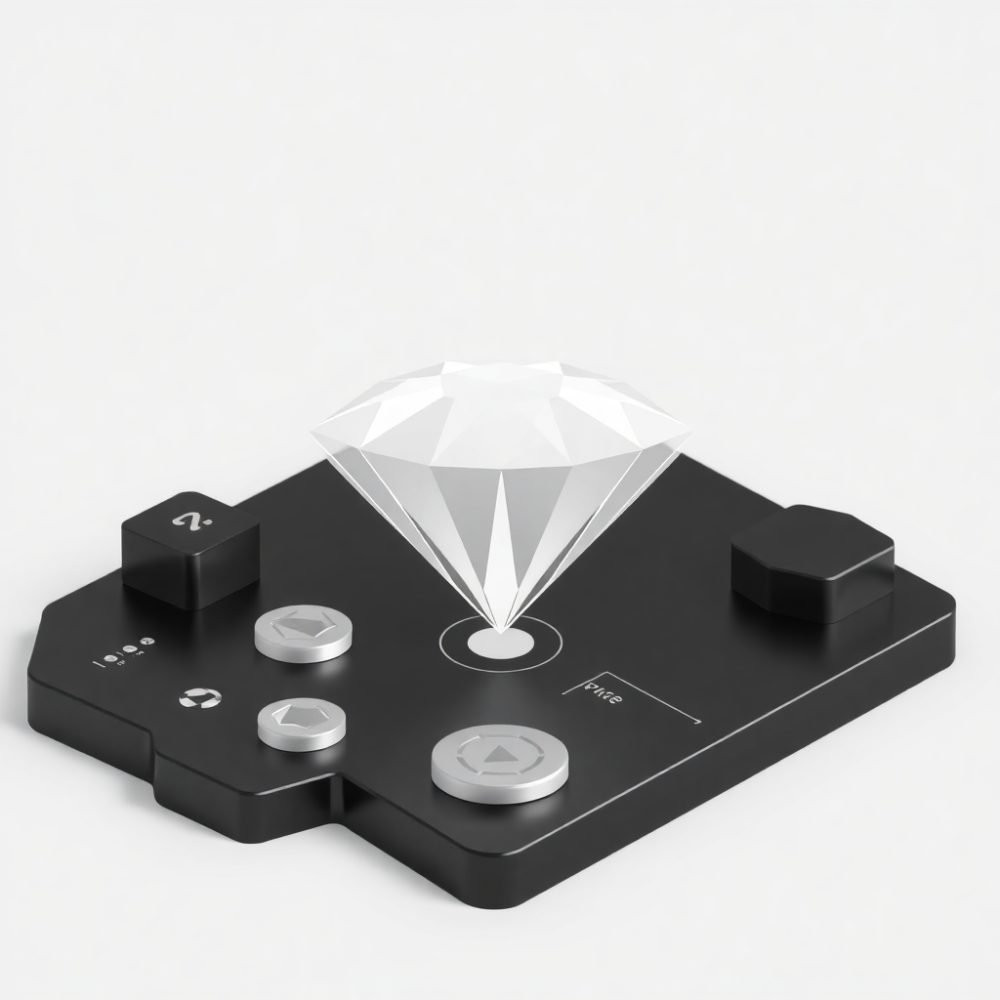

<p align="center">
    <br />
    
    <br />
</p>

# Digital Diamond Certificate (DDC) - User Website

**Access and manage your Digital Diamond Certificates powered by blockchain technology**

## Features
- View and verify your Digital Diamond Certificates
- Support for multiple DDC collections
- Support for multiple blockchain networks
- Comprehensive diamond properties and documentation
- Secure ownership verification
- _More features coming soon_

## Installation
### 1. Clone the repository
```bash
git clone https://github.com/yourusername/yd-marketplace
```

### 2. Install the dependencies
```bash
# npm
npm install

# yarn
yarn

# pnpm
pnpm install
```

### 3. Set up environment variables
Create a file called `.env.local` (at the root level of your project) with the following content:
```
NEXT_PUBLIC_TW_CLIENT_ID="<your-thirdweb-client-id"
```
Don't have a thirdweb clientId? [Grab one now](https://thirdweb.com/dashboard/settings/api-keys). Make sure you set up the `Allowed Domains` properly. [Learn how](https://portal.thirdweb.com/account/api-keys)

### 4. You're set
You can now run the platform in your local machine.
```bash
# npm
npm run dev

# yarn
yarn dev

# pnpm
pnpm dev
```

## Configuration

### 1. Supported networks
This platform supports multiple DDC collections across different networks. To add a chain (network), head to the file [`./src/consts/chains.ts`](./src/consts/chains.ts) and add that chain to the export array:
```typescript
export { sepolia, polygonAmoy } from "thirdweb/chains";
```

If the chain you are looking for is not in the [default list](https://portal.thirdweb.com/references/typescript/v5/variables), you can define your own chain using the `defineChain` method:

```typescript
// chain.ts
import { defineChain, sepolia } from "thirdweb/chains";

const yourChainId = 4747;
const yourCustomChain = defineChain(yourChainId);

export { sepolia, yourCustomChain }
```

### 2. DDC Contract Configuration
Add your DDC contract addresses and their respective chains in the file [`/src/consts/nft_contracts.ts`](/src/consts/nft_contracts.ts)

Example:
```typescript
import { sepolia } from "./chains";

export const NFT_CONTRACTS: NftContract[] = [
  {
    address: "your-ddc-contract-address",
    chain: sepolia,
    title: "DDC Collection Name",
    thumbnailUrl: "your-thumbnail-url",
    type: "ERC721",
  },
  // ... add more here
];
```

## Marketplace Features (Future Version)
The following features are planned for future marketplace functionality:

### Planned Features
- Create listings with custom payment currencies
- Buy and sell DDCs on the marketplace
- Support for multiple payment tokens
- Public profile pages with trading history

### Marketplace Configuration (Future)
When marketplace features are implemented, you will need to:
1. Deploy a [MarketplaceV3 contract](https://thirdweb.com/thirdweb.eth/MarketplaceV3)
2. Configure supported payment tokens
3. Set up marketplace contracts in [`/src/consts/marketplace_contracts.ts`](/src/consts/marketplace_contract.ts)

## Support

For technical support, please create an issue in this repository.

For thirdweb-related questions, visit [thirdweb support](https://thirdweb.com/support)

## Additional Resources

- [thirdweb Documentation](https://portal.thirdweb.com/typescript/v5)

## Security

If you believe you have found a security vulnerability, please email `security@yourdiamonds.com`.

